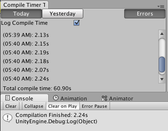
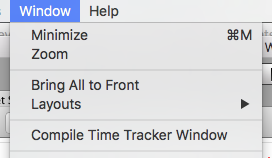

# compile-time-tracker
Unity editor extension which tracks compile time.

How do you optimize compile time? [Read This!](https://medium.com/@darrentsung/the-clocks-ticking-how-to-optimize-compile-time-in-unity-45d1f200572b#.q8h3v6a4f)

### To install:
Clone the git repository and add the CompileTimeTracker folder to your Unity project.

### Supported Versions:
Tested on Unity 5.0.0 and above. Might work on Unity 4, but haven't checked it out yet.

### Features:
Compile time is logged automatically to console and recent compile times can be viewed in the tracker window (Window -> Compile Time Tracker Window)

It also attempts to detect errors by comparing the number of error logs before compiling + after compiling, but it's not completely accurate as some code will cause errors logs during [InitializeOnLoad] or OnValidate calls.

